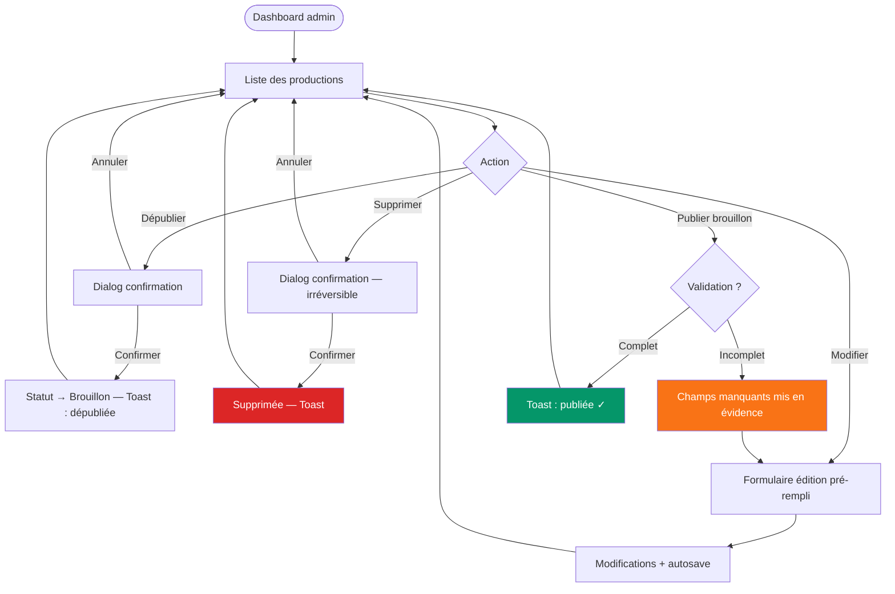
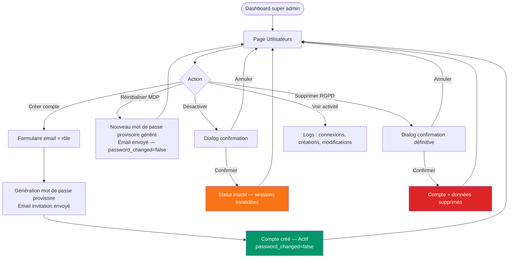

---
stepsCompleted:
  [
    step-01-init,
    step-02-discovery,
    step-03-core-experience,
    step-04-emotional-response,
    step-05-inspiration,
    step-06-design-system,
    step-07-defining-experience,
    step-08-visual-foundation,
    step-09-design-directions,
    step-10-user-journeys,
    step-11-component-strategy,
    step-12-ux-patterns,
    step-13-responsive-accessibility,
    step-14-complete,
  ]
status: complete
completedAt: '2026-04-04'
lastStep: 14
inputDocuments:
  ['_bmad-output/planning-artifacts/prd.md', '_bmad-output/planning-artifacts/architecture.md']
workflowType: 'ux-design'
project_name: 'anta'
user_name: 'Aurélien'
date: '2026-04-03'
---

# UX Design Specification — Anta

**Auteur :** Aurélien
**Date :** 2026-04-03

---

<!-- UX design content will be appended sequentially through collaborative workflow steps -->

## Résumé Exécutif

### Vision du Projet

Anta est une bibliothèque numérique centralisée pour une communauté académique — point d'accès unique à des productions intellectuelles (livres, articles, vidéos, podcasts) jusqu'ici dispersées entre domaines, pays et plateformes. La valeur est structurante : permettre à chacun, membre ou visiteur externe, de trouver, consulter et télécharger une production en moins de 3 interactions.

Deux surfaces distinctes coexistent dans un même produit : un **site public** ouvert sans friction, et un **panel admin** réservé aux administrateurs pour gérer le catalogue.

### Utilisateurs Cibles

**Kofi — Membre en quête d'une production**
Doctorant en mathématiques, familier du domaine. Il sait ce qu'il cherche. Son parcours idéal : recherche textuelle → filtre(s) → page détail → téléchargement. Il est impatient et ne tolèrera pas l'ambiguïté dans les résultats.

**Amara — Visiteur externe en découverte**
Chercheuse orientée par un collègue, sans connaissance préalable de la communauté. Elle explore, valide la pertinence via les compteurs et les métadonnées, puis télécharge sans créer de compte. Elle a besoin de signaux de confiance visuels pour s'engager.

**Fatou — Administratrice**
Reçoit des productions de membres et les centralise sur Anta. Son impératif : moins de 5 minutes entre la réception d'un fichier et sa publication. Contexte desktop exclusif. La saisie doit être guidante, pas pénible.

**Super admin — Gestionnaire des accès**
Usage rare mais critique : créer ou désactiver des comptes admin, consulter l'activité. Besoin de clarté et de contrôle, pas de sophistication.

### Défis UX Clés

1. **Découverte dans un catalogue hétérogène** — livres, articles, vidéos, podcasts en plusieurs langues sur des dizaines de domaines. La recherche et les filtres doivent guider sans submerger.
2. **Hiérarchie d'information sur la page détail** — 16+ champs de métadonnées, lecteur intégré, compteurs, téléchargement. Tout est pertinent mais pas au même niveau d'attention.
3. **Formulaire admin avec 15+ champs** — la publication est conditionnée à la complétude de toutes les métadonnées. La validation ne doit pas être punitive — elle doit être guidante.
4. **Transition brouillon → publication** — Fatou doit comprendre clairement ce qui manque avant de publier, sans friction inutile.

### Opportunités de Design

1. **Compteurs comme signal de confiance** — vues et téléchargements visibles en liste et en détail. Sur une bibliothèque académique, c'est une preuve sociale puissante qui valide la pertinence.
2. **Filtres facettés progressifs** — des filtres qui se réduisent selon les résultats disponibles transforment l'affinage en expérience fluide plutôt qu'en loterie.
3. **Lecteurs intégrés non intrusifs** — la production est la star. Les lecteurs PDF/EPUB/vidéo/audio doivent s'effacer et ne jamais bloquer l'accès au téléchargement.
4. **Dashboard admin orienté action** — liste de productions avec statut visible et actions directes (publier, modifier) sans navigation profonde.

## Expérience Utilisateur Centrale

### Expérience Définissante

Deux produits distincts coexistent dans Anta, chacun avec son action centrale :

**Site public — Trouver et accéder**
Le moment de valeur est l'instant où la liste de résultats se réduit jusqu'à la production recherchée. Tout le design sert ce moment. La recherche et les filtres sont le cœur absolu du site public.

**Panel admin — Publier une production**
Le moment de valeur est le statut "Publié" après un parcours de saisie sans friction. Tout le design oriente vers ce moment en moins de 5 minutes.

### Stratégie de Plateforme

| Surface     | Plateforme                                 | Interaction principale                |
| ----------- | ------------------------------------------ | ------------------------------------- |
| Site public | Web responsive — mobile, tablette, desktop | Tactile + souris/clavier selon device |
| Panel admin | Web desktop-first, fonctionnel tablette    | Souris/clavier — formulaires longs    |

Pas d'offline. Navigateurs modernes uniquement (2 dernières versions Chrome/Firefox/Edge/Safari).

### Interactions Sans Effort

**Site public :**

- Lancer une recherche — barre visible, centrale, immédiate
- Appliquer un filtre — sans rechargement de page, résultat instantané
- Lire les compteurs — signal de confiance visible au premier coup d'œil
- Télécharger — un clic, sans compte, sans formulaire
- Changer de langue — sélecteur accessible depuis toutes les pages

**Panel admin :**

- Enregistrer un brouillon — sans remplir tous les champs
- Comprendre ce qui manque pour publier — indicateur visuel des champs incomplets
- Uploader un fichier — drag-and-drop + sélecteur, retour visuel de progression
- Naviguer dans la liste des productions — statut visible au premier coup d'œil

### Moments de Succès Critiques

**Moment #1 — La liste se réduit (site public)**
Kofi tape "topologie", clique "Article", clique "Mathématiques". La liste passe de 200 à 4 résultats. Il reconnaît l'auteur. Ce moment doit prendre au maximum 3 interactions.

**Moment #2 — La publication réussit (admin)**
Fatou clique "Publier". Le statut passe à "Publié" avec un feedback immédiat. La production est visible sur le site public. Moins de 5 minutes se sont écoulées.

**Moment #3 — La découverte inattendue (site public)**
Amara filtre "Littérature africaine" sans savoir ce qu'elle trouvera. Elle tombe sur des articles avec 200+ vues. Filtres + compteurs créent la confiance. Elle télécharge sans hésiter.

### Principes d'Expérience

1. **La production, pas l'interface** — l'UI s'efface derrière le contenu. Métadonnées, lecteur et téléchargement sont la star. Tout élément décoratif superflu est un obstacle.
2. **La progression, pas la perfection** — chaque interaction réduit l'espace de recherche (public) ; chaque sauvegarde brouillon est un progrès valable (admin).
3. **Zéro friction pour l'accès** — aucun compte, aucune inscription, aucune barrière pour consulter ou télécharger.
4. **La clarté avant l'esthétique** — statuts, champs obligatoires, compteurs : tout ce qui oriente une décision doit être immédiatement lisible.

## Réponse Émotionnelle Souhaitée

### Objectifs Émotionnels Primaires

**Site public — Satisfaction efficace**
L'émotion juste n'est pas l'enthousiasme ni l'émerveillement — c'est celle du chercheur qui ferme son navigateur avec le fichier téléchargé et le sentiment d'avoir bien utilisé son temps. Efficacité + confiance.

**Panel admin — Maîtrise sereine**
Fatou doit se sentir compétente et en contrôle. Chaque publication réussie est une petite victoire. Le panel est un outil qu'on maîtrise, pas un formulaire qu'on subit.

### Parcours Émotionnel

| Moment           | Site public                                                 | Panel admin                                   |
| ---------------- | ----------------------------------------------------------- | --------------------------------------------- |
| Arrivée          | Curiosité + orientation rapide                              | Concentration (je sais ce que je viens faire) |
| Pendant l'action | Focus + confiance que le résultat est atteignable           | Guidé, jamais submergé                        |
| Accomplissement  | Satisfaction calme ("j'ai trouvé / téléchargé")             | Fierté ("publié en 4 minutes")                |
| En cas d'erreur  | Frustration minimisée — on sait immédiatement quoi faire    | Guidé vers la solution, jamais puni           |
| Au retour        | Familiarité rassurante — l'outil fonctionne toujours pareil | Confiance dans l'outil                        |

### Micro-émotions Clés

**Confiance > Scepticisme**
Les compteurs de vues et téléchargements visibles en liste et en détail signalent que la communauté utilise réellement la bibliothèque. Le visiteur ne doit jamais douter de la pertinence d'une source.

**Orientation > Confusion**
Les filtres actifs doivent être visibles à tout moment (chips/tags). Sur l'admin, le statut d'une production (brouillon / publié / dépublié) doit être immédiatement lisible sans chercher.

**Accomplissement > Frustration**
Le feedback de publication doit être explicite et immédiat. Sur le site public, le téléchargement démarre instantanément, sans suspense.

**Appartenance (membres)**
Kofi voit les productions de sa communauté avec les noms qu'il reconnaît, les domaines qui lui parlent. L'identité communautaire transparaît sans être affichée.

### Implications pour le Design

| Émotion visée    | Choix UX                                                                          |
| ---------------- | --------------------------------------------------------------------------------- |
| Confiance        | Compteurs visibles dès la liste, métadonnées riches sur la page détail            |
| Orientation      | Filtres actifs persistants (chips), statuts de production codés en couleur        |
| Accomplissement  | Feedback visuel explicite après publication (toast "Production publiée")          |
| Maîtrise (admin) | Indicateur de progression du formulaire, champs manquants signalés pro-activement |
| Appartenance     | Mise en valeur des noms d'auteurs, domaines et catégories                         |

### Émotions à Éviter

- **Anxiété de publication** — autosave brouillon systématique, jamais de perte de données
- **Doute sur les résultats** — les filtres actifs expliquent toujours pourquoi la liste a cette forme
- **Honte de l'erreur** — messages de validation pointant vers la solution, jamais vers la faute

## Analyse des Patterns UX & Inspiration

### Produits Inspirants

**Google Search → Site public**

- Barre de recherche comme point d'entrée absolu — rien ne distrait, tout converge vers elle
- Liste de résultats en 3 niveaux hiérarchiques : titre → snippet de contexte → métadonnées
- Filtres/chips toujours visibles en haut de page, jamais enfouis
- Décompte de résultats immédiat ("24 productions")
- Requête active toujours visible — on sait pourquoi on voit ces résultats

**YouTube → Navigation catalogue + lecteurs**

- Compteurs de vues affichés sur chaque card avant d'ouvrir — signal de confiance immédiat
- Badge de format/durée visible sur la vignette elle-même
- Player minimaliste — l'interface s'efface au profit du contenu
- Chips de catégorie horizontales — filtrage rapide en un clic, toujours visible
- Hiérarchie titre + auteur + compteurs d'un seul coup d'œil

**Facebook Search → Anti-référence**

- Résultats sans hiérarchie, types mélangés sans séparation
- Filtres enfouis dans des sous-menus
- Bruit visuel rivalisant avec les résultats
- Absence de décompte et de contexte de requête

### Patterns Transférables

**Navigation et Recherche (Google)**

| Pattern                                 | Application sur Anta                                                 |
| --------------------------------------- | -------------------------------------------------------------------- |
| Barre de recherche centrée et dominante | Accueil + listing : barre en position hero                           |
| Chips de filtres persistants            | Filtres catégorie / domaine / langue toujours visibles sous la barre |
| Décompte de résultats                   | "24 productions" en tête de liste                                    |
| Filtre actif visible et supprimable     | Chips colorés, cliquables pour retirer le filtre                     |

**Cards et Compteurs (YouTube)**

| Pattern                                 | Application sur Anta                                                   |
| --------------------------------------- | ---------------------------------------------------------------------- |
| Compteur sur la card                    | Vues + téléchargements visibles en listing sans cliquer                |
| Badge de format                         | Icône PDF / EPUB / MP4 / MP3 sur chaque card                           |
| Hiérarchie titre → auteur → métadonnées | Lecture immédiate sans ouvrir le détail                                |
| Player minimaliste                      | Lecteur sans chrome inutile, bouton téléchargement toujours accessible |

**Formulaire Admin (meilleures pratiques CMS)**

| Pattern                          | Application sur Anta                                          |
| -------------------------------- | ------------------------------------------------------------- |
| Sauvegarde automatique brouillon | Toutes les 30s ou à chaque blur de champ                      |
| Validation inline                | Erreur sous le champ à la perte de focus, pas à la soumission |
| Indicateur de complétion         | "Champs restants pour publication" visible en permanence      |
| Actions sticky                   | "Enregistrer brouillon" et "Publier" toujours visibles        |
| Statut codé en couleur           | Brouillon = gris, Publié = vert, Dépublié = orange            |

### Anti-Patterns à Éviter

- ❌ Filtres dans un tiroir/menu caché → filtres toujours visibles sur la page
- ❌ Résultats sans contexte de requête → requête + filtres actifs toujours affichés
- ❌ Validation uniquement à la soumission → frustrant sur 15+ champs
- ❌ Player plein écran forcé → le lecteur cohabite avec métadonnées et téléchargement
- ❌ Pagination ambiguë → numérotation classique visible, pas de "Charger plus"

### Stratégie d'Inspiration

**Adopter directement :** chips de filtres persistants (Google), compteurs sur les cards (YouTube), hiérarchie titre → snippet → action (Google)

**Adapter :** cards YouTube → cards Anta avec badge format + auteur + métadonnées académiques ; player YouTube → lecteur Anta avec principes identiques (contenu au centre, contrôles discrets)

**Éviter :** tout ce qui ressemble à la recherche Facebook — mélange de types, opacité des filtres, bruit visuel

## Design System

### Choix du Design System

**Tailwind CSS v4 + shadcn/ui** — système themeable avec composants personnalisables.

Catégorie : système à base de composants open-source (code source livré dans le projet, zéro dépendance runtime opaque). Basé sur Radix UI pour l'accessibilité ARIA.

### Justification

- **Vitesse** — composants prêts à l'emploi couvrant 90% des besoins Anta
- **Personnalisation totale** — le code source des composants vit dans le projet, modifiable sans override
- **Accessibilité intégrée** — Radix UI gère ARIA par défaut
- **Cohérence** — Tailwind comme seul système de tokens visuels, aucun composant n'invente ses propres valeurs
- **Alignement architecture** — déjà décidé dans le document d'architecture

### Composants shadcn/ui Utilisés

| Composant                     | Usage                                                     |
| ----------------------------- | --------------------------------------------------------- |
| `Card`                        | Productions en listing (public + admin)                   |
| `Badge`                       | Statuts (Brouillon/Publié/Dépublié), formats (PDF/MP4...) |
| `Button`                      | Toutes les actions (Publier, Télécharger, Filtrer...)     |
| `Dialog`                      | Confirmations (supprimer, dépublier)                      |
| `Form` + `Input` + `Textarea` | Formulaire création/édition production                    |
| `Select`                      | Filtres (catégorie, domaine, langue...)                   |
| `Table`                       | Liste des productions admin, stats                        |
| `Toast`                       | Feedback publication réussie                              |
| `Pagination`                  | Navigation dans les listes                                |
| `Tabs`                        | Navigation admin                                          |

### Palette de Couleurs

Contexte : bibliothèque académique d'une communauté à ancrage africain — crédibilité intellectuelle + chaleur communautaire.

| Rôle             | Couleur           | Token Tailwind | Valeur hex |
| ---------------- | ----------------- | -------------- | ---------- |
| Primaire         | Vert soutenu      | `green-700`    | `#15803d`  |
| Accent           | Brun chocolat     | `amber-900`    | `#78350f`  |
| Fond général     | Blanc cassé chaud | `stone-50`     | `#FAFAF9`  |
| Surface cards    | Blanc pur         | `white`        | `#FFFFFF`  |
| Texte principal  | Bleu nuit         | `slate-900`    | `#0F172A`  |
| Texte secondaire | Gris ardoise      | `slate-500`    | `#64748B`  |

**Couleurs de statut :**

| Statut    | Token         | Hex       |
| --------- | ------------- | --------- |
| Publié    | `emerald-600` | `#059669` |
| Brouillon | `slate-400`   | `#94A3B8` |
| Dépublié  | `orange-500`  | `#F97316` |

### Logo et Identité Visuelle

**Fichier source :** `_docs/logo_anta_512.png` (512×512px, fond blanc, format PNG)

**Asset de production :** copier vers `public/images/logo_anta.png` — servi en statique par AdonisJS.

**Favicon :** `public/favicon.png` — même fichier source (le navigateur le redimensionne).

| Contexte            | Élément             | Taille                      | Alt text |
| ------------------- | ------------------- | --------------------------- | -------- |
| Header site public  | ``             | `height: 40px` (auto width) | `"Anta"` |
| Sidebar panel admin | ``             | `height: 32px` (auto width) | `"Anta"` |
| Favicon             | `<link rel="icon">` | navigateur                  | —        |

**Règle d'usage :**

- Le logo est toujours cliquable — lien vers `/` (site public) ou `/admin/productions` (panel admin)
- Ne jamais recadrer, déformer ou changer les couleurs du logo
- Sur fond `stone-50` ou `white` uniquement — le fond blanc du logo est intégré

**Wireframe mis à jour :**

```
Header public :
[]               [FR | EN]

Sidebar admin :
[]
───────────────────
```

### Stratégie de Personnalisation

Tokens définis une fois dans `app.css` via CSS custom properties Tailwind v4 — tout le système en hérite :

```css
@theme {
  --color-primary: var(--color-green-700);
  --color-accent: var(--color-amber-900);
  --color-background: var(--color-stone-50);
  --color-surface: var(--color-white);
}
```

**Usage des couleurs :**

- `primary` : boutons d'action principale, liens actifs, éléments sélectionnés
- `accent` : badges de format, compteurs mis en valeur, hover sur cards
- Statuts : badges uniquement, jamais en fond de page

## Expérience Utilisateur Centrale

### Expérience Définissante

**Site public : "Chercher et trouver en moins de 3 interactions"**
La promesse tient en une phrase. Le moment de vérité est le rétrécissement de la liste de résultats — pas le téléchargement, pas le lecteur. Kofi tape, filtre, reconnaît.

**Panel admin : "Saisir et publier en moins de 5 minutes"**
Fatou ne doit jamais se demander où elle en est, ce qu'il lui reste à faire, ni si ses données sont perdues. Le formulaire guide, l'autosave accompagne, la publication récompense.

### Modèle Mental des Utilisateurs

**Visiteurs publics — modèle Google**
Réflexe universel : barre de recherche + mots-clés + filtres + clic. Aucune éducation nécessaire. Notre avantage : exécuter ces patterns mieux que les outils académiques datés.

**Admins — modèle formulaire CMS**
Réflexe connu : remplir, sauvegarder, publier. Distinction claire brouillon/publication. Retour visuel immédiat après chaque action.

### Critères de Succès

**Site public ✅ si :**

- Liste mise à jour en < 300ms après application d'un filtre
- Production trouvée en ≤ 3 interactions depuis n'importe quelle page
- Bouton téléchargement visible sans scroller sur la page détail
- Filtres actifs toujours visibles — jamais besoin de mémoriser ce qui est appliqué

**Panel admin ✅ si :**

- Nombre de champs manquants visible à tout moment
- Aucune perte de données (autosave)
- Feedback "Publication réussie" immédiat et sans ambiguïté
- Brouillons retrouvés dans l'état exact où ils ont été laissés

### Patterns : Établis — Exécution Irréprochable

| Pattern                        | Familiarité          | Différenciation Anta                     |
| ------------------------------ | -------------------- | ---------------------------------------- |
| Barre de recherche + filtres   | Universelle (Google) | Chips persistants et supprimables        |
| Cards de résultats             | Universelle          | Compteurs + badge format intégrés        |
| Formulaire multi-champs        | Universelle          | Autosave + indicateur de complétion      |
| Workflow brouillon/publication | Connue (CMS)         | Indicateur proactif des champs manquants |

### Mécaniques de l'Expérience

#### Flux Recherche Publique

```
1. INITIATION
   └─ Barre de recherche centrée, placeholder : "Rechercher une production..."
   └─ Filtres disponibles sous la barre (catégorie, domaine, langue, pays, licence)

2. INTERACTION
   └─ Saisie → résultats mis à jour (debounce 300ms)
   └─ Clic filtre → chip apparaît, liste réduite, compteur mis à jour
   └─ Clic chip actif → filtre retiré, liste élargie

3. FEEDBACK
   └─ Compteur : "24 productions" → "6 productions" → "4 productions"
   └─ Chips colorés (filtres actifs, supprimables)
   └─ Aucun résultat → message + suggestion de retirer un filtre

4. COMPLÉTION
   └─ Clic card → page détail
   └─ Bouton "Télécharger" above the fold
   └─ Téléchargement instantané — un clic, sans confirmation
```

#### Flux Publication Admin

```
1. INITIATION
   └─ Clic "Nouvelle production"
   └─ Formulaire en sections : Métadonnées / Contenu / Fichiers & Liens
   └─ Indicateur : "0/12 champs — brouillon uniquement"

2. INTERACTION
   └─ Validation inline à la perte de focus sur chaque champ
   └─ Autosave brouillon toutes les 30s (indicateur discret "Sauvegardé")
   └─ Upload : drag-and-drop + sélecteur, barre de progression
   └─ Indicateur mis à jour en temps réel

3. FEEDBACK
   └─ Champ invalide → bordure rouge + message inline
   └─ "12/12 champs + 1 fichier → Publication disponible" → bouton "Publier" actif

4. COMPLÉTION
   └─ Clic "Publier" → toast "Production publiée — visible sur le site public"
   └─ Redirection liste, production en tête avec badge "Publié" vert

## Fondations Visuelles

### Système de Couleurs

| Rôle | Token Tailwind | Hex |
|---|---|---|
| Primaire | `green-700` | `#15803d` |
| Accent | `amber-900` | `#78350f` |
| Fond général | `stone-50` | `#FAFAF9` |
| Surface cards | `white` | `#FFFFFF` |
| Texte principal | `slate-900` | `#0F172A` |
| Texte secondaire | `slate-500` | `#64748B` |
| Statut Publié | `emerald-600` | `#059669` |
| Statut Brouillon | `slate-400` | `#94A3B8` |
| Statut Dépublié | `orange-500` | `#F97316` |

**Règle accent :** `amber-900` (brun chocolat) peut être utilisé en fond décoratif ET en couleur de texte — ratio 8.1:1 sur blanc (AAA). Aucune restriction d'usage.

### Système Typographique

| Élément | Police | Taille | Graisse |
|---|---|---|---|
| Titre de production | Playfair Display | `text-2xl` 24px | 700 |
| Titre de page (H1) | Playfair Display | `text-3xl` 30px | 700 |
| Titre de section (H2/H3) | Inter | `text-xl` 20px | 600 |
| Corps de texte | Inter | `text-base` 16px | 400 |
| Métadonnées (cards) | Inter | `text-sm` 14px | 400 |
| Labels formulaire | Inter | `text-sm` 14px | 500 |
| Texte secondaire | Inter | `text-xs` 12px | 400 |

Taille minimale pour texte informatif : **14px** (`text-sm`).

### Espacement & Layout

- Unité de base : **4px** (système Tailwind natif)
- Densité : **modérée**

| Surface | Largeur max | Structure |
|---|---|---|
| Site public — listing | `max-w-7xl` 1280px | 3 colonnes desktop / 2 tablette / 1 mobile |
| Site public — détail | `max-w-5xl` 1024px | 2/3 contenu + 1/3 métadonnées sidebar |
| Panel admin | Full-width | Sidebar fixe 240px + zone principale flexible |
| Formulaire admin | `max-w-2xl` | Colonne unique centrée |

### Accessibilité

| Combinaison | Ratio | Niveau |
|---|---|---|
| `green-700` sur `white` | 5.74:1 | ✅ AA |
| `slate-900` sur `white` | 17.4:1 | ✅ AAA |
| `slate-500` sur `white` | 4.7:1 | ✅ AA |
| `white` sur `green-700` | 5.74:1 | ✅ AA |
| `amber-900` sur `white` | 8.1:1 | ✅ AAA |

Toutes les combinaisons texte/fond respectent au minimum le niveau AA (WCAG 2.1).

## Direction de Design

### Directions Explorées

Quatre directions ont été présentées via le fichier `ux-design-directions.html` :

| Direction | Concept | Points forts |
|---|---|---|
| 1 — Classique | Sidebar filtres + grille cards | Multi-select intuitif, tri et compteur bien visibles |
| 2 — Minimaliste | Hero search + chips + liste | Barre de recherche centrée, filtres proéminents, snippet de contexte |
| 3 — Moderne (dark) | Thème sombre + grille dense | Aspect tech moderne — non retenu (inadapté au contexte académique) |
| 4 — Éditoriale | Hero featured + catalogue | Valorise les productions — non retenu pour le listing général |

### Direction Retenue — Hybrid 1+2

**Base : Direction 2** avec ajustements de la Direction 1.

**Structure de la zone de contrôle :**
```

[Barre de recherche centrée — hero, bien visible]
[Chips filtres horizontaux — multi-select, persistants]
──────────────────────────────────────────────────────
[47 productions] [Trier par : Plus récent ▾] [≡ ⊞]
toggle liste/grille

````

**Décisions spécifiques :**

| Élément | Décision |
|---|---|
| Barre de recherche | Centrée en hero (Direction 2) |
| Système de filtres | Chips horizontaux multi-select (Direction 2) — confirmation : multi-select natif par clic |
| Filtres actifs | Chips vert (green-700) avec bouton ×, persistants |
| Compteur de résultats | Proéminent — taille et contraste augmentés vs Direction 2 |
| Tri | Dropdown visible à côté du compteur (Direction 1) |
| Mode listing | Toggle liste/grille à droite du tri |
| Mode par défaut | Liste verticale avec snippets (Direction 2) |
| Mode alternatif | Grille de cards (Direction 1) |

### Justification

La Direction 2 gagne sur la visibilité de la recherche et des filtres — ce qui est critique pour l'expérience centrale d'Anta. Les ajustements de la Direction 1 corrigent les faiblesses identifiées (compteur effacé, tri absent). Le toggle liste/grille donne à l'utilisateur la flexibilité sans imposer un seul mode.

## Flux des Parcours Utilisateurs

### Flux 1 — Recherche et Accès au Contenu (Public)

```mermaid
flowchart TD
    A([Arrivée sur Anta]) --> B{Page d'entrée}
    B -->|Accueil| C[Section 1 : Productions les plus consultées\nSection 2 : Récemment ajoutées\n+ barre de recherche + filtres visibles\nAucune recherche active]
    B -->|URL directe listing| D[Page listing]

    C -->|Clic sur une production| I
    C -->|Saisie dans la barre| D

    D --> E[Saisie dans la barre de recherche]
    E --> F[Résultats mis à jour — debounce 300ms]
    F --> G{Résultats satisfaisants ?}

    G -->|Non| H[Appliquer un filtre — chip multi-select]
    H --> F

    G -->|Non — 0 résultats| Z[Message : aucun résultat + suggestion retirer filtre]
    Z --> H

    G -->|Oui| I[Clic sur une card]
    I --> J[Page de détail — métadonnées complètes]

    J --> K{Action souhaitée}
    K -->|Lire en ligne| L{Type de fichier}
    L -->|PDF/EPUB| M[Lecteur intégré]
    L -->|MP4| N[Lecteur vidéo]
    L -->|MP3/AAC| O[Lecteur audio]

    K -->|Télécharger| P[Téléchargement direct — 1 clic]
    K -->|Source externe| Q[Redirection lien externe]

    M --> P
    P --> R([Succès — fichier téléchargé])
    Q --> S([Succès — redirection])

    style R fill:#059669,color:#fff
    style S fill:#059669,color:#fff
    style Z fill:#F97316,color:#fff
````

**Point critique :** L'état "0 résultats" doit suggérer une action corrective, pas seulement afficher un message.

### Flux 2 — Publication d'une Production (Admin)

```mermaid
flowchart TD
    A([Connexion panel admin]) --> B[Saisie email + mot de passe provisoire]
    B --> C{Mot de passe\nchangé ?}

    C -->|Non — première connexion\nou après reset| D[Redirection : Définir un nouveau mot de passe]
    D --> E[Saisie + confirmation nouveau mot de passe]
    E --> F{MDP valide ?}
    F -->|Non| E
    F -->|Oui — password_changed=true| G{2FA activé ?}

    C -->|Oui| G

    G -->|Non| H[Redirection activation 2FA]
    H --> H2[QR code → scan → code de vérification]
    H2 --> H3{Code valide ?}
    H3 -->|Non| H2
    H3 -->|Oui — totp_enabled=true| I[Dashboard]

    G -->|Oui| J[Saisie code TOTP]
    J --> K{Code valide ?}
    K -->|Non| J
    K -->|Oui| I

    I --> L[Liste des productions]
    L --> M[Nouvelle production]
    M --> N[Formulaire — indicateur : 0/12 champs]

    N --> O[Saisie métadonnées]
    O --> P[Autosave brouillon — 30s]
    P --> Q[Upload fichier ou ajout lien]
    Q --> R{Tous champs + 1 fichier/lien ?}

    R -->|Non| S[Champs manquants mis en évidence\nBouton Publier désactivé]
    S --> O

    R -->|Oui| T[Bouton Publier actif]
    T --> U[Clic Publier]
    U --> V[Toast : Production publiée ✓]
    V --> W([Succès — production visible publiquement])

    style W fill:#059669,color:#fff
    style S fill:#F97316,color:#fff
    style P fill:#15803d,color:#fff
```

**Point critique :** L'autosave est silencieux — indicateur discret "Sauvegardé à 14:32", jamais intrusif.

### Flux 3 — Modification et Workflow Brouillon/Dépublié (Admin)



### Flux 4 — Gestion des Comptes (Super Admin)



### Patterns de Flux Transversaux

| Pattern              | Règle                                                                       |
| -------------------- | --------------------------------------------------------------------------- |
| Actions destructives | Dialog de confirmation obligatoire — jamais d'action irréversible en 1 clic |
| Feedback réussite    | Toast non-bloquant (3s) + mise à jour visuelle immédiate dans la liste      |
| Erreur de validation | Pointage direct vers le champ — pas de message global en haut de page       |
| État de chargement   | Bouton désactivé + spinner — pas de double-soumission possible              |
| Autosave             | Silencieux — indicateur discret, jamais intrusif                            |

## Stratégie des Composants

### Composants shadcn/ui — Couverture Existante

| Composant                     | Usage                                         |
| ----------------------------- | --------------------------------------------- |
| `Card`                        | Base des cards de production                  |
| `Badge`                       | Format de fichier, statuts                    |
| `Button`                      | Toutes les actions                            |
| `Dialog`                      | Confirmations (supprimer, dépublier)          |
| `Form` + `Input` + `Textarea` | Formulaire création/édition production        |
| `Select`                      | Tri des résultats, sélecteurs admin           |
| `Table`                       | Liste productions admin, stats, logs activité |
| `Toast`                       | Feedback après toute action                   |
| `Pagination`                  | Navigation dans les listes                    |
| `Tabs`                        | Navigation panel admin                        |
| `Skeleton`                    | États de chargement                           |

### Composants Custom

#### `SearchBar`

Barre de recherche principale. Input + icône loupe + bouton × (reset). Debounce 300ms → mise à jour liste sans rechargement. `role="search"`, `aria-label`, `aria-controls` pointant vers la liste.

#### `FilterChip`

Chip de filtre multi-select. États : inactif (bordure grise) / actif (fond green-700, bouton ×). Variante avec dropdown pour filtres à valeurs multiples (ex. domaine). `aria-pressed="true/false"`.

#### `FilterBar`

Conteneur horizontal des chips. Zone chips disponibles + chips actifs + bouton "Effacer tout". Scroll horizontal sur mobile. `role="group"`, `aria-label="Filtres de recherche"`.

#### `ProductionCard`

Card de production pour le listing — deux variantes :

- `list` : badge format + titre Playfair Display + auteur + domaine + date + compteurs + bouton télécharger + snippet
- `grid` : badge format + compteurs + titre + auteur/date
  `<article>`, titre dans `<h2>`, compteurs avec `aria-label` descriptif.

#### `ListingToggle`

Toggle liste/grille. Deux boutons icône groupés. Préférence sauvegardée en localStorage. `role="group"`, `aria-pressed`.

#### `MediaViewer`

Conteneur unifié pour tous les formats. Sélectionne le sous-composant selon le MIME type :

- PDF/EPUB → `PdfViewer` (bibliothèque décidée en Epic 3)
- MP4 → `<video>` natif
- MP3/AAC → `<audio>` natif stylisé
  Lecteur occupe 2/3 page, métadonnées 1/3, bouton téléchargement toujours above the fold.

#### `FileUploader`

Upload drag-and-drop. États : vide / drag-over (bordure green-700 animée) / en cours (barre de progression) / succès / erreur (format ou taille). Validation côté client avant upload (100Mo max, whitelist MIME).

#### `CompletionIndicator`

Indicateur de complétion formulaire admin. "10/12 champs — 2 requis pour publier" + liste des champs manquants cliquables. Sticky en haut du formulaire. Mis à jour en temps réel. États : incomplet (orange) / complet (vert → bouton Publier actif).

#### `LanguageSwitcher`

Sélecteur FR/EN dans le header. Clic → change langue via react-i18next + sauvegarde cookie `i18n_lang`. `aria-current="true"` sur la langue active.

#### `ViewTracker`

Composant invisible. Mount → setTimeout(10 000ms) → POST `/stats/view` → nettoyage au unmount. Pas d'UI.

#### `LinkManager`

Interface admin pour gérer les liens externes. Liste des liens existants + formulaire "Ajouter un lien" (URL + type + label). Ajout inline sans rechargement.

### Roadmap d'Implémentation

| Phase             | Composants                                                                                                                      | Priorité                   |
| ----------------- | ------------------------------------------------------------------------------------------------------------------------------- | -------------------------- |
| 1 — Critique      | `SearchBar`, `FilterBar`, `FilterChip`, `ProductionCard`, `ListingToggle`, `CompletionIndicator`, `FileUploader`, `ViewTracker` | Bloque les flux principaux |
| 2 — Important     | `MediaViewer`, `LanguageSwitcher`, `LinkManager`                                                                                | Complète l'expérience      |
| 3 — Améliorations | Animations, skeletons avancés, états d'erreur enrichis                                                                          | Optimisation               |

---

## Étape 12 — Patterns UX de Cohérence

### Hiérarchie des Actions

#### Boutons — Niveaux Visuels

| Niveau          | Style                                                   | Quand l'utiliser                                                     |
| --------------- | ------------------------------------------------------- | -------------------------------------------------------------------- |
| **Primaire**    | `bg-green-700 text-white`                               | Action principale unique par page (Publier, Télécharger, Rechercher) |
| **Secondaire**  | `border border-green-700 text-green-700 bg-transparent` | Action alternative importante (Enregistrer brouillon, Annuler)       |
| **Tertiaire**   | `text-green-700 underline` ou `text-stone-600`          | Actions de moindre priorité (Réinitialiser filtres, Voir plus)       |
| **Destructeur** | `bg-red-600 text-white`                                 | Suppression, dépublication — toujours précédé d'une confirmation     |

**Règle absolue** : jamais deux boutons primaires visibles simultanément dans la même zone d'action. Le formulaire admin n'affiche "Publier" comme primaire qu'une fois `CompletionIndicator` au vert — jusque-là, "Enregistrer brouillon" est primaire.

#### États des Boutons

Chaque bouton doit couvrir 5 états : default / hover / focus (ring green visible) / disabled (opacité 40%, cursor-not-allowed) / loading (spinner inline, texte masqué, interaction désactivée). Le loading prévient le double-submit.

---

### Patterns de Feedback

#### Hiérarchie des Notifications

| Type               | Style                                    | Durée              | Cas d'usage                                       |
| ------------------ | ---------------------------------------- | ------------------ | ------------------------------------------------- |
| **Succès**         | Toast vert en bas à droite               | 3 secondes         | Publication, enregistrement, téléversement réussi |
| **Erreur système** | Toast rouge persistant + bouton "Fermer" | Jusqu'à fermeture  | Erreur réseau, upload échoué                      |
| **Avertissement**  | Bannière ambre en haut du formulaire     | Jusqu'à résolution | Champs manquants avant publication                |
| **Info**           | Toast gris neutre                        | 3 secondes         | Copie de lien, action neutre                      |

**Règle** : les toasts se superposent verticalement (max 3 simultanés). Les plus anciens disparaissent d'abord. Jamais d'alert() natif.

#### Feedback Inline sur Formulaires

Validation au `onBlur` — pas au keystroke (évite le rouge immédiat). Message d'erreur affiché sous le champ en `text-red-600 text-sm`. Message de succès optionnel (coche verte) sur les champs critiques (email admin). Le `CompletionIndicator` se met à jour en temps réel à chaque `onChange`.

---

### Patterns de Formulaire Admin

#### Structure Visuelle du Formulaire de Production

```
[CompletionIndicator sticky — "10/12 champs — 2 requis pour publier"]
─────────────────────────────────────────────────────
Section : Informations générales
  Titre *          [champ texte]
  Auteur(s) *      [multi-select]
  Catégorie *      [select]
  Domaine *        [select]
  Sous-domaine     [select, conditionnel]
  Langue *         [select]
  Pays *           [select]
─────────────────────────────────────────────────────
Section : Contenu
  Résumé *         [textarea]
  Date de l'œuvre  [date picker — champ libre ou année seule]
─────────────────────────────────────────────────────
Section : Fichiers & Liens
  [FileUploader]   PDF / EPUB / MP4 / MP3 / AAC — max 100 Mo
  [LinkManager]    Liens externes (URL + type + label)
─────────────────────────────────────────────────────
Section : Droits & Licence
  Statut licence * [select : libre / copyright]
─────────────────────────────────────────────────────
[Enregistrer brouillon]   [Publier — actif uniquement si CompletionIndicator vert]
```

#### Champs Conditionnels

- **Sous-domaine** : affiché uniquement après sélection d'un Domaine
- **Lien externe** : si `statut_licence = copyright`, un lien externe est obligatoire pour publier (le `CompletionIndicator` le signale)
- **FileUploader** : visible toujours — mais la publication requiert au moins un fichier hébergé OU un lien externe

---

### Navigation — Patterns

#### Site Public

**Header (sticky)**

```
[]         [FR | EN]
──────────────────────────────────────────────────────────
```

Simple, sans distraction. Le `LanguageSwitcher` est la seule action globale.

**Page d'accueil → Page listing** : la `SearchBar` est présente sur les deux. Sur la page d'accueil, elle est proéminente (hero). Sur la page listing, elle est en haut avec la `FilterBar` directement en dessous.

**Breadcrumb** : `Accueil > [Recherche] > [Titre production]` sur la page détail uniquement.

**Footer** : Politique de confidentialité + copyright communauté.

#### Panel Admin

**Sidebar (fixe, desktop)**

```
[]
───────────────────
📚 Productions          ← tous les admins
📊 Statistiques         ← tous les admins
───────────────────
👥 Utilisateurs         ← super admin uniquement (masqué pour admin)
───────────────────
[Badge rôle : Admin / Super Admin]
[Nom + email]
[Se déconnecter]
```

**Règle super admin** : l'entrée "Utilisateurs" est rendue conditionnellement selon le rôle. Elle n'est pas simplement grisée — elle est absente pour les comptes `admin`. Le super admin voit un badge distinctif dans la sidebar et dans le header.

**État actif** : item sidebar actif = fond `green-100`, texte `green-700`, bordure gauche `green-700` (3px).

---

### États Vides

| Surface                   | Message                                                                     | Action proposée               |
| ------------------------- | --------------------------------------------------------------------------- | ----------------------------- |
| Résultats de recherche    | "Aucune production trouvée pour « {terme} »"                                | Réinitialiser les filtres     |
| Listing admin vide        | "Aucune production. Commencez par en créer une."                            | Bouton "Créer une production" |
| Statistiques vides        | "Aucune donnée pour cette période."                                         | —                             |
| Fichiers d'une production | "Aucun fichier ajouté. Ajoutez un fichier ou un lien pour pouvoir publier." | —                             |

Ton : factuel, non-dramatique. Pas d'illustrations complexes — un pictogramme simple en `text-stone-300` maximum.

---

### Patterns Recherche & Filtres

#### Homepage — Mode Découverte (sans recherche active)

```
[SearchBar centrée — placeholder "Rechercher une production..."]
[FilterBar — chips de catégories]
──────────────────────────────────────
Section "Les plus consultées"
  [grille de ProductionCard]

Section "Récemment ajoutées"
  [grille de ProductionCard]
```

Aucune recherche active = les deux sections sont visibles. Le visiteur peut filtrer par catégorie même sans texte.

#### Page Listing — Mode Recherche Active

```
[SearchBar] [bouton Rechercher]
[FilterBar avec FilterChips actifs]
["{N} résultats" — count visible] [Trier par ▼] [☰ Liste | ⊞ Grille]
──────────────────────────────────────────────────────────────────
[liste ou grille de ProductionCard]
[Pagination numérotée]
```

La transition homepage → listing s'effectue dès qu'une recherche ou un filtre est appliqué. L'URL reflète l'état (`?q=terme&category=livre&page=2`).

#### Comportement des Filtres

- **Multi-select** : plusieurs FilterChips peuvent être actifs simultanément
- **Réinitialisation** : bouton "Effacer filtres" visible uniquement quand au moins un filtre est actif
- **Persistance** : les filtres restent actifs lors de la pagination (paramètres URL)

---

### Patterns Modaux & Confirmations

#### Règle d'Usage des Modaux

Les modaux sont réservés aux **actions destructrices irréversibles** uniquement :

- Suppression d'une production
- Dépublication d'une production publiée
- Désactivation d'un compte admin
- Reset du mot de passe admin (super admin)

Pour les actions réversibles (enregistrer brouillon, annuler formulaire avec données non sauvegardées), utiliser un toast ou une bannière — pas de modal.

#### Structure du Modal de Confirmation

```
┌────────────────────────────────────────┐
│ [Icône avertissement]                  │
│ Supprimer cette production ?           │
│                                        │
│ Cette action est irréversible. La      │
│ production et ses fichiers associés    │
│ seront supprimés définitivement.       │
│                                        │
│           [Annuler]  [Supprimer]       │
└────────────────────────────────────────┘
```

- Bouton destructeur = rouge, à droite
- Bouton annulation = secondaire, à gauche
- Fond overlay semi-transparent (`bg-black/50`)
- Fermeture par Échap ou clic sur l'overlay = annulation
- Focus piégé dans le modal (accessibilité)
- `role="alertdialog"` + `aria-describedby` sur le texte explicatif

````

---

## Étape 13 — Responsive Design & Accessibilité

### Stratégie Responsive

Anta comprend deux surfaces avec des stratégies opposées.

**Site public — Mobile-first**

- **Mobile (< 768px)** : SearchBar pleine largeur, FilterChips en défilement horizontal (scroll snap), liste de résultats en colonne unique, bouton Télécharger proéminent en bas de la page détail
- **Tablette (768–1023px)** : FilterBar sur 2 lignes max, grille 2 colonnes optionnelle, page détail avec sidebar métadonnées
- **Desktop (1024px+)** : FilterBar complète visible, toggle list/grille, page détail en layout 2 colonnes (contenu principal + métadonnées + actions)

**Panel admin — Desktop-first**

- **Desktop (1024px+)** : sidebar fixe + zone de contenu principale, formulaire en colonnes sur grands écrans
- **Tablette (768–1023px)** : sidebar collapsible (icônes seules), formulaire en colonne unique — fonctionnel mais non optimisé
- **Mobile** : non supporté. Afficher un message d'avertissement si accès mobile détecté : "Veuillez utiliser le panel admin sur un ordinateur."

### Stratégie Breakpoints

Breakpoints Tailwind CSS v4 standard :

| Breakpoint | Valeur | Usage |
|---|---|---|
| (base) | 0–639px | Mobile — site public |
| `sm` | 640px | Mobiles paysage |
| `md` | 768px | Tablette portrait |
| `lg` | 1024px | Tablette paysage / laptop — seuil admin |
| `xl` | 1280px | Desktop standard |
| `2xl` | 1536px | Grand écran — densité augmentée |

Approche : classes Tailwind mobile-first pour le site public. Panel admin avec `lg:` comme point de départ.

### Stratégie Accessibilité

**Niveau cible : WCAG 2.1 AA**

Justification : bibliothèque académique publique, audience diversifiée incluant des utilisateurs avec handicaps visuels ou moteurs. AA est le standard industriel et la référence légale dans la plupart des juridictions.

**Contraintes couleurs à respecter impérativement :**

| Élément | Règle | Ratio |
|---|---|---|
| `amber-900` sur blanc | Validé pour texte et fond décoratif | 8.1:1 (AAA) |
| `green-700` sur blanc | Validé pour texte et icônes | 5.74:1 (AA) |
| `stone-600` sur blanc | Validé pour texte secondaire | > 4.5:1 (AA) |
| `stone-300` sur blanc | Interdit pour texte — décoratif uniquement | Insuffisant |

**Exigences AA :**

- **Contraste** : 4.5:1 minimum texte normal, 3:1 grands textes (18px+ bold)
- **Navigation clavier** : tous les éléments interactifs atteignables au Tab, ordre logique, skip link "Aller au contenu" en première position du DOM
- **Focus visible** : `ring-2 ring-green-700 ring-offset-2` sur `:focus-visible` — jamais supprimé sans remplacement
- **Cibles tactiles** : minimum 44×44px pour tous les éléments cliquables
- **Alt textes** : images significatives documentées, images décoratives `alt=""`
- **ARIA** : `role="alertdialog"` sur modaux, `aria-expanded` sur dropdowns, `aria-current="page"` sur navigation active, `aria-live="polite"` sur toasts et `CompletionIndicator`
- **Formulaires** : chaque `<input>` associé à `<label>`, messages d'erreur liés via `aria-describedby`
- **HTML sémantique** : `<main>`, `<nav>`, `<header>`, `<aside>`, hiérarchie `h1` unique par page

### Stratégie de Tests

**Tests Responsive**

| Test | Méthode |
|---|---|
| Breakpoints | Chrome DevTools Device Mode (320, 375, 768, 1024, 1280px) |
| Navigateurs | Chrome, Firefox, Edge, Safari — 2 dernières versions |
| Orientation | Portrait et paysage tablette |

**Tests Accessibilité**

| Test | Outil |
|---|---|
| Audit automatisé | axe DevTools — intégré avant chaque PR |
| Contraste couleurs | Colour Contrast Analyser (validation design) |
| Navigation clavier | Test manuel Tab/Shift+Tab/Entrée/Échap — tous les flux |
| Lecteur d'écran | NVDA + Firefox (Windows) — flux recherche → détail → téléchargement |
| Daltonisme | Chrome DevTools > Rendering > Emulate vision deficiencies |

Critère de validation : zéro violation axe niveau AA avant mise en production de chaque composant critique.

### Guidelines d'Implémentation

**Responsive :**

```tsx
// Mobile-first avec Tailwind
<div className="grid grid-cols-1 md:grid-cols-2 xl:grid-cols-3 gap-4">

// Sidebar admin — masquée sur mobile
<aside className="hidden lg:flex lg:w-64 ...">
<div className="lg:hidden p-4 text-center">
  Veuillez utiliser le panel admin sur un ordinateur.
</div>
````

**Accessibilité :**

```tsx
// Skip link (premier élément du <body>)
<a href="#main-content" className="sr-only focus:not-sr-only focus:absolute ...">
  Aller au contenu principal
</a>

// Toast accessible
<div role="status" aria-live="polite" aria-atomic="true">
  {toast.message}
</div>

// Modal accessible
<div role="alertdialog" aria-modal="true"
     aria-labelledby="modal-title" aria-describedby="modal-desc">

// CompletionIndicator
<div aria-live="polite" aria-atomic="false">
  {completedFields}/12 champs — {missingCount} requis pour publier
</div>

// FilterChip multi-select
<button role="checkbox" aria-checked={isActive}
        aria-label={`Filtrer par ${label}`}>
```

**Ordre de priorité d'implémentation accessibilité :**

1. Navigation clavier complète (Tab order + focus visible)
2. Labels et ARIA sur formulaires admin
3. Skip link + structure sémantique HTML
4. Toasts et alertes `aria-live`
5. Test lecteur d'écran sur flux principal (recherche → détail → téléchargement)
